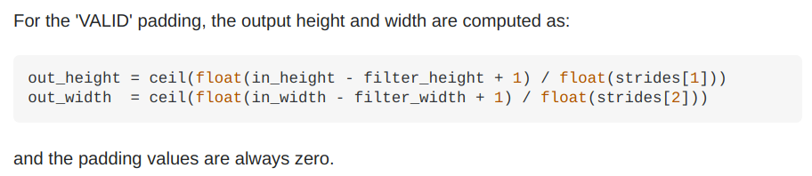
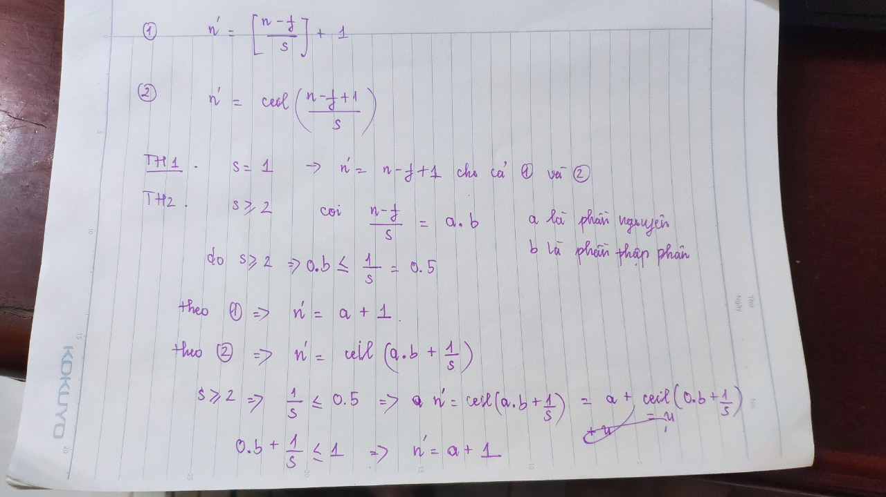
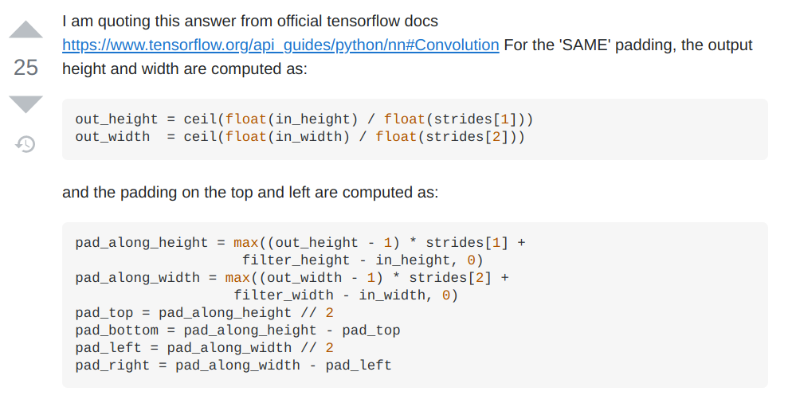

Cần hiểu rõ hơn về Convolution với padding = 'valid' và padding = 'same'

## Padding='valid'
Nói chúng trường hợp này khá đơn giản mình không phải thêm padding vào input. Cứ tính như công thức bình thường thôi.

$$n' = [\frac{n + 2p - f}{s}] + 1 = [\frac{n- f}{s}] +1 ~~~~~~~~(1)$$

trong đó dâu ngoặc vuông là lấy phần nguyên hay hàm `math.floor()` trong Python..
$n'$ - output dimension
$n$ - input dimension
$p$ - padding, ở đây $p=0$ do padding = 'valid'
$f$ - kích thước của kernel size

Có thể xem thêm file pdf để hiểu rõ hơn. Ở đây mình trình bày một số ý chính. Hiện tại mình làm cho một chiều, các chiều khác cũng tương tự. Trong thực tế như ảnh chẳng hạn chúng ta hay để các spatial dimensions như nhau.


Công thức (1) có thể được viết lại như sau

$$ n' = ceil(\frac{n - f + 1}{s}) ~~~~~~~ (2) $$

Ở đây padding = 0 nên mình không ghi vào. Có thể chứng minh công thức (1) tương đương với công thức (2).



## Padding='same'



$$ n' = ceil(\frac{n}{s})$$

```python
print(math.ceil(3))     # output 3
print(math.ceil(3.1))   # output 4
```

Đối với các chiều còn lại cũng tương tự. Nhận thấy trong các bài toán Computer Vision, input dimension thường là số chẵn và nếu chúng ta có `strides=2` khi đó output dimension sẽ bằng một nửa so với input dimension. Điều này khá giống với với Pooling layer (không cần tham số học, Conv layer cần tham số học). Trong mô hình GANs khi muốn giảm kích thước lên 2 lần người ta thường dùng Conv layer với `strides=2` và `padding='same'` để giảm kích thước. Số filters và kernel size có thể chọn cho phù hợp.

Chúng ta cần tính padding cho mỗi chiều, giả sử ở đây chúng ta đang tính dimension theo height, chúng ta sẽ tính pad_top và pad_bottom. Tương tự đối với width dimension chúng ta cũng tính được pad_left và pad_right.

$$ p_{height} = max((n' - 1) \cdot s + f - n, 0)$$

Khi đó

$$p_{top} = p_{height} {//} 2$$

$$p_{bottom} = p_{height} - p_{top}$$

Đây là công thức tổng quát tính output dimensions và pad theo các chiều trong trường hợp `padding='same'`:
- Với `strides = 1` chúng ta có output dimension bằng với input dimension
- Với `stride > 1` chúng ta có **output dimension** nhỏ hơn so với input dimension và ở đây chúng ta cần tính zero padding vào các phía.

Trong Tensorflow, nếu dùng transposed convolution với paddding = 'same' thì output size = input size * strides. Có thời gian tìm hiểu thêm về cái này.

# Tài liệu tham khảo
1. https://stackoverflow.com/questions/37674306/what-is-the-difference-between-same-and-valid-padding-in-tf-nn-max-pool-of-t

2. https://stackoverflow.com/questions/53819528/how-does-tf-keras-layers-conv2d-with-padding-same-and-strides-1-behave

